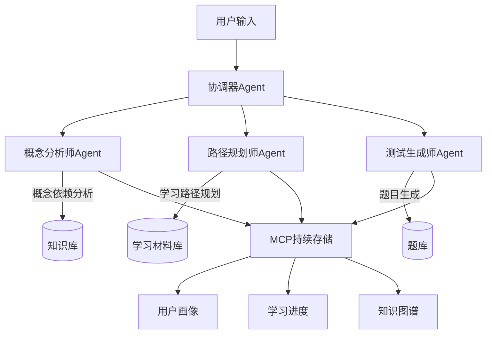
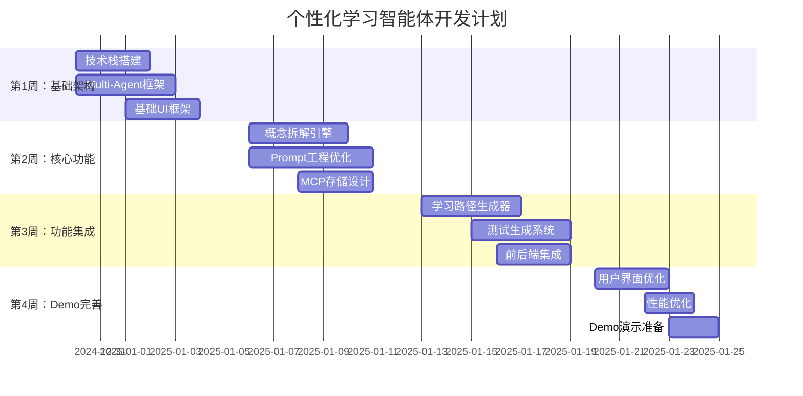
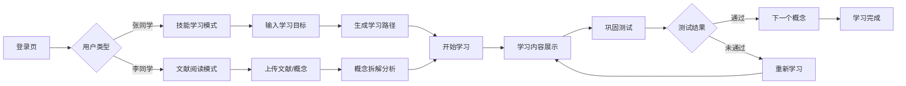
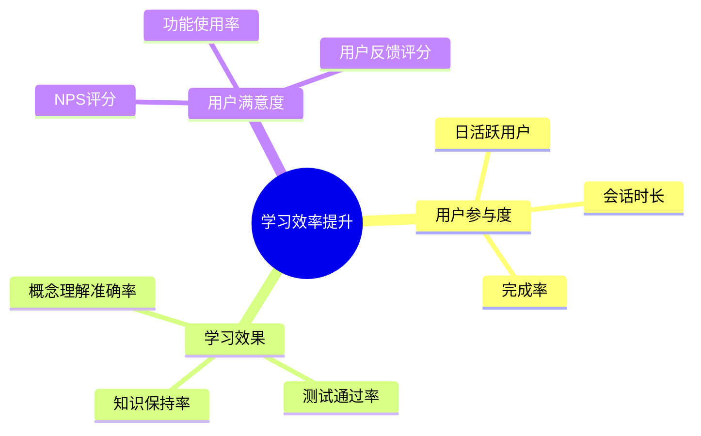

# 个性化学习智能体 - 产品开发计划

## 📋 项目概述

### 核心问题
- **张同学痛点**：网上资料碎片化，不知道学习路径对不对，需要节约精力和时间
- **李同学痛点**：论文术语多，跨学科知识难以串联，需要拆解复杂概念

### 解决方案
构建一个基于Multi-Agent的个性化学习智能体，能够：
1. 智能拆解复杂概念，识别前置知识
2. 生成个性化学习路径
3. 提供自适应巩固测试

---

## 🎯 MVP 核心功能定义

### Must-Have 功能（4周内完成）

#### 1. 概念拆解引擎 🧠
- **输入**：复杂概念/论文/理论
- **输出**：前置概念依赖图 + 分层讲解
- **核心能力**：
  - 识别用户未理解的前置概念
  - 将复杂概念拆解为可理解的小块
  - 提供多种讲解角度（类比、实例、图解）

#### 2. 学习路径生成器 🗺️
- **输入**：学习意图 + 现有基础
- **输出**：个性化学习路径
- **核心能力**：
  - 根据用户基础调整难度曲线
  - 推荐多样化学习材料
  - 设置学习检查点

#### 3. 巩固测试系统 📝
- **输入**：已学概念
- **输出**：个性化测试题
- **核心能力**：
  - 多种题型生成（选择、填空、应用）
  - 根据答题情况调整难度
  - 提供详细解析

### Nice-to-Have 功能（后续迭代）
- 公式推导可视化
- 知识图谱可视化
- 学习社区功能
- 多语言支持

---

## 🏗️ 技术架构设计

### Multi-Agent 教研团队架构



### 推荐技术栈

#### AI模型层
- **主模型**：Claude 3.5 Sonnet（概念理解能力强）
- **辅助模型**：GPT-4o（多模态支持）
- **开源备选**：Qwen2.5-72B（成本控制）

#### 后端架构
- **框架**：FastAPI + Python
- **数据库**：PostgreSQL + Vector DB (Qdrant)
- **缓存**：Redis
- **消息队列**：Celery + Redis

#### 前端技术
- **框架**：Next.js 14 + TypeScript
- **UI库**：Tailwind CSS + Shadcn/ui
- **状态管理**：Zustand
- **图表**：D3.js（知识图谱可视化）

#### MCP集成
- **存储**：PostgreSQL + JSON字段
- **同步**：WebSocket实时更新
- **备份**：定期快照到云存储

---

## 📅 4周冲刺计划



---

## 🎨 用户界面设计

### 核心界面流程



### 关键页面设计
1. **概念拆解页面**：左侧文献，右侧概念树
2. **学习路径页面**：时间轴式进度展示
3. **测试页面**：多种题型混合，即时反馈

---

## 🔧 核心Prompt工程策略

### 1. 概念拆解Prompt模板
```
你是一位资深教育专家。用户提供了一个复杂概念，请：

1. 分析这个概念需要的前置知识
2. 识别用户可能不理解的部分
3. 将概念拆解为3-5个递进层次
4. 为每个层次提供：
   - 简单定义
   - 生活化类比
   - 具体例子

概念：{concept}
用户背景：{user_background}
```

### 2. 降低幻觉策略
- **事实验证**：关键信息要求提供来源
- **不确定性表达**：明确标注推测性内容
- **多角度验证**：同一概念用不同方式解释
- **用户反馈循环**：允许用户纠正错误

---

## 📊 成功指标定义

### 北极星指标
**学习效率提升率** = (使用产品后学习速度 - 使用前学习速度) / 使用前学习速度

### 关键指标树



### 验证实验设计
1. **A/B测试**：传统学习 vs AI辅助学习
2. **用户访谈**：每周与5名目标用户深度访谈
3. **数据追踪**：学习路径完成率、概念理解测试分数

---

## ⚠️ 风险评估与应对

### 高风险项
| 风险 | 影响 | 概率 | 应对策略 |
|------|------|------|----------|
| AI模型幻觉问题 | 高 | 中 | 多重验证机制 + 人工审核 |
| 用户获取困难 | 高 | 中 | 校园推广 + KOL合作 |
| 技术复杂度超预期 | 中 | 高 | 简化MVP功能 + 分阶段开发 |

### 决策检查点
- **第2周末**：概念拆解准确率是否达到80%？
- **第3周末**：用户测试反馈是否积极？
- **第4周末**：Demo是否能完整演示核心流程？

---

## 💰 成本估算

### 开发成本（4周）
- **人力成本**：4人团队 × 4周 = 16人周
- **AI API成本**：预估$500/月（开发期）
- **云服务成本**：$200/月
- **总计**：约$700 + 人力成本

### 运营成本（月度）
- **AI API**：$2000-5000（取决于用户量）
- **云服务**：$500-1000
- **总计**：$2500-6000/月

---

## 🚀 下一步行动计划

### 本周任务分配
- **技术负责人**：搭建基础架构，选择AI模型
- **产品负责人**：完善用户故事，设计交互流程
- **前端开发**：创建UI组件库，实现基础页面
- **后端开发**：设计数据库结构，实现API框架

### 关键里程碑
- **第1周**：技术栈确定，基础框架搭建完成
- **第2周**：概念拆解功能可用，Prompt调优完成
- **第3周**：完整功能流程打通，内部测试通过
- **第4周**：Demo完成，用户测试反馈收集

---

## 📚 附录

### 竞品分析
- **Khan Academy**：个性化学习，但缺乏概念拆解
- **Coursera**：结构化课程，但不够个性化
- **Anki**：记忆巩固，但缺乏理解引导

### 技术参考资料
- [Multi-Agent系统设计模式](https://example.com)
- [教育AI应用最佳实践](https://example.com)
- [MCP协议文档](https://example.com)

---

🎯 **你的下一步行动**：在接下来24小时内，确定团队成员分工，开始技术栈搭建和基础架构设计。

---
📥 **保存为**：`个性化学习智能体-产品开发计划-2024-12-28.md`